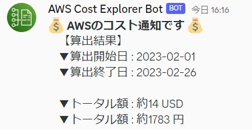

# discord_cost_check
AWSの月間コスト算出結果をDiscordに通知します

（README作成中）

【discord】 
webhookURLを作成します

【AWS】 
Lambda関数：discord_cost_check_lambda.py 
　→web_hookのurlは置き換えてください。 
EventBridgeルール：discord_cost_check_event.json 
　→7日間ごとに実行します。Targetは置き換えてください。 

## 出力イメージ

